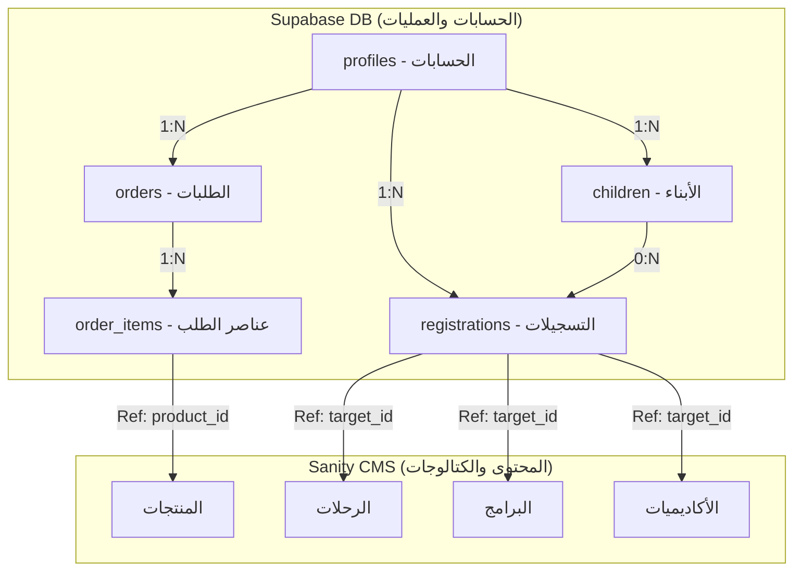

# دليل تكامل قاعدة بيانات Supabase لمنصة ملهم

يغطي هذا الدليل تصميم قاعدة البيانات، مواصفات الجداول، العلاقات البرمجية، سياسات أمان مستوى السجل (RLS)، وإرشادات إعداد وتكامل قاعدة بيانات **Supabase** مع تطبيق منصة ملهم دون تكرار محتوى Sanity CMS.

---

## 1. نظرة عامة على البنية البرمجية
للحفاظ على سرعة وأداء الموقع وسهولة الصيانة، تم الفصل تماماً بين البيانات الديناميكية والعمليات المالية من جهة، وبيانات إدارة المحتوى من جهة أخرى:
* **لوحة تحكم Sanity CMS (للقراءة فقط في الواجهة)**: تدير المحتوى التسويقي، الأسعار، التصنيفات، وقوائم العناصر لكل من:
  * الرحلات (`trips`)
  * البرامج الصيفية والأنشطة (`programs`)
  * الأكاديميات التدريبية (`academies`)
  * منتجات المتجر (`products`)
* **قاعدة بيانات Supabase (للقراءة والكتابة)**: تدير حسابات المستخدمين، الملفات الشخصية، ربط الأبناء بأولياء الأمور، تسجيلات البرامج والرحلات، وطلبات المتجر وعمليات الدفع.



---

## 2. مواصفات الجداول والعلاقات

### جدول الحسابات الشخصية (`public.profiles`)
يخزن معلومات إضافية للمستخدمين وأولياء الأمور. تتم مزامنته تلقائياً فور تسجيل المستخدمين عبر نظام مصادقة Supabase Auth.
* **`id`** (`UUID`): مرتبط بجدول المصادقة الأساسي `auth.users(id)` (مفتاح أساسي، حذف متتالي).
* **`full_name`** (`TEXT`): الاسم الكامل للمستخدم.
* **`phone`** (`TEXT`): رقم الجوال.
* **`email`** (`TEXT`): البريد الإلكتروني (فريد).
* **`role`** (`TEXT`): صلاحية المستخدم، إما `'user'` (عضو عادي) أو `'admin'` (مدير نظام).
* **`created_at` / `updated_at`** (`TIMESTAMP`): تواريخ الإنشاء والتعديل.

### جدول الأبناء والبنات (`public.children`)
يخزن بيانات الأبناء التابعين لولي أمر معين.
* **`id`** (`UUID`): مفتاح أساسي.
* **`parent_id`** (`UUID`): مرتبط بجدول الحسابات `public.profiles(id)` (حذف متتالي).
* **`full_name`** (`TEXT`): الاسم الثلاثي للابن/الابنة.
* **`gender`** (`TEXT`): جنس الابن، مقيد بـ (`'ذكر'` أو `'أنثى'`).
* **`grade`** (`TEXT`): الصف الدراسي الحالي (مثال: `'الصف الأول الابتدائي'`).

### جدول التسجيلات (`public.registrations`)
يخزن طلبات الاشتراك في الرحلات والأكاديميات والبرامج والفرص التطوعية.
* **`id`** (`UUID`): مفتاح أساسي.
* **`user_id`** (`UUID`): مرتبط بجدول الحساب شخصي `public.profiles(id)` (حذف متتالي).
* **`child_id`** (`UUID`): مرتبط بجدول الأبناء `public.children(id)` (تصفير القيمة عند الحذف). يكون فارغاً في حال تسجيل العضو لنفسه (كتطوع).
* **`full_name`** (`TEXT`): الاسم الكامل للمسجل في الفعالية (لسرعة العرض).
* **`age`** (`INTEGER`): العمر المحسوب بناءً على الصف الدراسي.
* **`phone` / `email`** (`TEXT`): أرقام الاتصال المخصصة لهذا الطلب.
* **`interests`** (`TEXT[]`): مصفوفة الاهتمامات أو الحقول المحددة.
* **`type`** (`TEXT`): نوع التسجيل، مقيد بـ (`'trip'`, `'academy'`, `'program'`, `'volunteer'`).
* **`target_id`** (`TEXT`): يشير إلى **معرف المستند أو الـ Slug في Sanity CMS**. **لا يتم تكرار بيانات البرنامج الفعلية هنا.**
* **`target_name`** (`TEXT`): اسم/عنوان الفعالية للعرض السريع في لوحة تحكم العميل دون الحاجة لاستعلام Sanity في كل مرة.
* **`payment_method`** (`TEXT`): طريقة الدفع المفضلة (بطاقة ائتمانية، نقدي، تابي).
* **`status`** (`TEXT`): حالة الاشتراك، مقيد بـ (`'pending'` قيد المراجعة، `'approved'` مقبول، `'completed'` منتهٍ).

### جدول الطلبات (`public.orders`)
يخزن عمليات شراء المنتجات عبر المتجر الإلكتروني للمنصة.
* **`id`** (`UUID`): مفتاح أساسي.
* **`user_id`** (`UUID`): مرتبط بجدول الحسابات `public.profiles(id)` (يسمح بالقيمة الفارغة في حال الشراء كزائر).
* **`customer_name` / `phone` / `email` / `address`** (`TEXT`): بيانات الاتصال وعنوان الشحن والتوصيل للطلب.
* **`total`** (`NUMERIC`): المبلغ الإجمالي المستحق للطلب.
* **`payment_method`** (`TEXT`): وسيلة الدفع، مقيدة بـ (`'tap'` دفع إلكتروني، `'cod'` دفع عند الاستلام).
* **`status`** (`TEXT`): حالة الطلب، مقيدة بـ (`'pending'`, `'paid'`, `'shipped'`).

### جدول عناصر الطلبات (`public.order_items`)
يخزن تفاصيل وكميات المنتجات المشتراة داخل كل طلب.
* **`id`** (`UUID`): مفتاح أساسي.
* **`order_id`** (`UUID`): مرتبط بجدول الطلبات الرئيسي `public.orders(id)` (حذف متتالي).
* **`product_id`** (`TEXT`): يشير إلى **معرف المنتج أو الـ Slug في Sanity CMS**.
* **`product_name`** (`TEXT`): اسم المنتج المسجل عند الشراء كأرشيف للفاتورة.
* **`price`** (`NUMERIC`): سعر المنتج الفردي أثناء الشراء.
* **`quantity`** (`INTEGER`): الكمية المطلوبة (يجب أن تكون أكبر من 0).

### جدول رسائل اتصل بنا (`public.contact_messages`)
يخزن جميع نماذج الدعم والاستفسارات والشكاوى المرسلة من العملاء.
* **`id`** (`UUID`): مفتاح أساسي.
* **`name` / `email` / `phone` / `subject` / `message`** (`TEXT`): بيانات الرسالة المدخلة.

---

## 3. الأمان وحماية مستوى السجل (Row Level Security - RLS)

تم تفعيل ميزة أمان السجلات (RLS) على جميع جداول قاعدة البيانات لضمان عدم وصول أي مستخدم لبيانات غيره، بينما يمتلك المشرفون (`admin`) الصلاحية الكاملة لإدارة النظام.

| اسم الجدول | سياسة القراءة (SELECT) | سياسة الإضافة (INSERT) | سياسة التعديل (UPDATE) | سياسة الحذف (DELETE) |
| :--- | :--- | :--- | :--- | :--- |
| `profiles` | صاحب الحساب أو المشرف | تلقائي عبر نظام المصادقة | صاحب الحساب أو المشرف | المشرفون فقط |
| `children` | ولي الأمر أو المشرف | ولي الأمر فقط | ولي الأمر أو المشرف | ولي الأمر أو المشرف |
| `registrations` | صاحب الحساب أو المشرف | صاحب الحساب فقط | صاحب الحساب أو المشرف | المشرفون فقط |
| `orders` | صاحب الحساب أو المشرف | مسموح للجميع (أعضاء وزوار) | المشرفون فقط | المشرفون فقط |
| `order_items` | صاحب الطلب أو المشرف | مسموح للجميع (أعضاء وزوار) | المشرفون فقط | المشرفون فقط |
| `contact_messages` | المشرفون فقط | مسموح للجميع (أعضاء وزوار) | المشرفون فقط | المشرفون فقط |

---

## 4. خطوات الإعداد في لوحة تحكم Supabase

1. **إنشاء الجداول والسياسات**:
   * توجه إلى قسم **SQL Editor** في لوحة تحكم Supabase الخاصة بمشروعك.
   * افتح الملف المسمى `supabase/schema.sql` الموجود في المجلد الرئيسي للمشروع.
   * انسخ كافة محتويات الملف ثم الصقها في المحرر واضغط **Run**.
2. **إضافة متغيرات البيئة**:
   * قم بإدراج المفاتيح التالية في ملفك المحلي `.env.local`:
     ```env
     NEXT_PUBLIC_SUPABASE_URL="رابط مشروعك في Supabase"
     NEXT_PUBLIC_SUPABASE_ANON_KEY="مفتاح ANON العام الخاص بك"
     ```
3. **الاستخدام في واجهة التطبيق**:
   * اعتمد على عميل Supabase الجاهز في المسار `src/utils/supabase.ts` لإجراء الاستعلامات وعمليات الإدخال.
   * استخدم أنواع البيانات الجاهزة من الملف `src/types/database.types.ts` لتسهيل التحقق والتوافق التام مع TypeScript.
